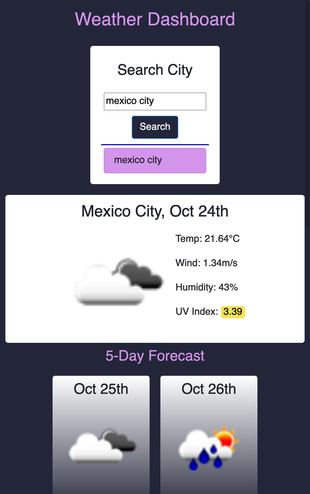
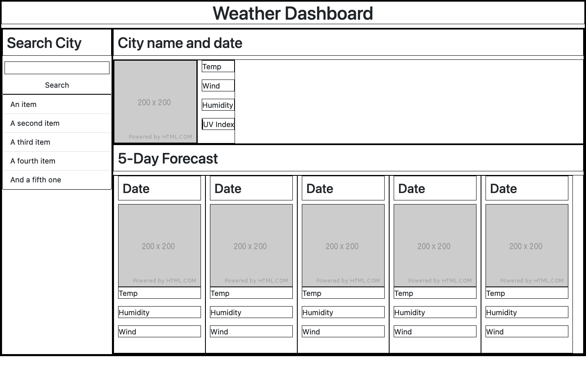

# Weather Dashboard

Weather dashboard with current weather and 5-day forecast.

This responsive weather dashboard utilizes the Open Weather One Call API to render the current and 5-day forecast weather for a given city. Data includes the temperature, humidity, wind speed, UV index with color-coded indicator, and the corresponding weather icons. Recently searched cities appear in the left-hand search bar and are saved in local storage.

## User Story

GIVEN the user is planning travels in a new city  
WHEN they search the city name  
THEN they are presented with the current and 5-day forecast weather for that city

WHEN the user views the current weather conditions  
THEN they are presented with the city name, current date, temperature, humidity, wind speed, UV index, and an icon representing the weather conditions

WHEN the user views the UV index  
THEN they are shown a color indicator representing the UV conditions: green for low, yellow for moderate, orange for high, red for very high, and purple for extreme UV conditions

WHEN the user views the weather for their searched city  
THEN they are also presented with the 5-day forecast including the date, weather conditions image, temperature, humidity, and wind speed

WHEN the user searches a city name  
THEN the city is listed in a list of recent searches

WHEN the user clicks on a city in the rendered search history  
THEN they are presented with the current and forecast weather conditions for that city

## Deployed Application

## Built With

- CSS
- HTML
- Javascript
- Open Weather One Call API

## Screenshots

### Desktop

### Mobile

### Wireframe

